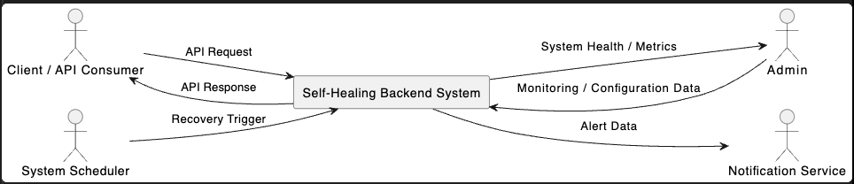
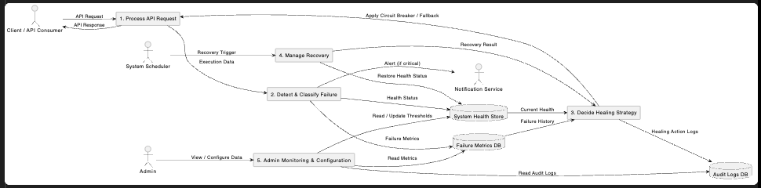

# DFD Overview – Self-Healing Backend System

## 1. Introduction

This document provides an overview of the Data Flow Diagrams (DFD) for the Self-Healing Backend System. The DFDs focus on how data moves between external entities, internal processes, and persistent data stores. Unlike UML, which emphasizes system behavior, DFDs emphasize data flow and transformation.

⸻

## 2. DFD Level 0 – Context Diagram

### 2.1 Purpose

The Level 0 DFD (Context Diagram) represents the entire Self-Healing Backend System as a single process. It shows how the system interacts with external entities without exposing internal details.

### 2.2 External Entities
	•	Client / API Consumer – Sends API requests and receives API responses.
	•	Admin – Receives system health and metrics, and sends monitoring or configuration data.
	•	System Scheduler – Triggers recovery processes periodically.
	•	Notification Service – Receives alert data when critical failures occur.

### 2.3 Context Diagram

⸻

## 3. DFD Level 1 – Decomposed Diagram

### 3.1 Purpose

The Level 1 DFD decomposes the main system into core internal processes. It illustrates how requests are processed, how failures are detected and analyzed, how healing decisions are made, and how recovery is managed.

### 3.2 Major Processes
	1.	Process API Request – Handles incoming requests and generates responses.
	2.	Detect & Classify Failure – Identifies runtime issues and determines their severity.
	3.	Decide Healing Strategy – Chooses appropriate self-healing actions such as circuit breaking or fallback responses.
	4.	Manage Recovery – Attempts system recovery and restores normal operation.
	5.	Admin Monitoring & Configuration – Allows administrators to monitor system behavior and configure thresholds.

### 3.3 Data Stores
	•	Failure Metrics DB – Stores historical failure data.
	•	System Health Store – Maintains the current health state of the system.
	•	Audit Logs DB – Records healing actions and recovery attempts for traceability.

### 3.4 Level 1 Diagram

⸻

## 4. Relationship with UML Diagrams

The DFDs are consistent with the UML Use Case Diagram:
	•	UML API Processing → DFD Process API Request
	•	UML Failure Monitoring → DFD Detect & Classify Failure
	•	UML Self-Healing Decision Engine → DFD Decide Healing Strategy
	•	UML Recovery Management → DFD Manage Recovery
	•	UML Monitoring & Administration → DFD Admin Monitoring & Configuration

This alignment ensures conceptual consistency across design artifacts.

⸻

## 5. Summary

The DFD Level 0 and Level 1 diagrams together provide a clear understanding of how data flows through the Self-Healing Backend System. They demonstrate how the system processes requests, manages failures, applies self-healing logic, performs recovery, and communicates with external entities while maintaining persistent records.

⸻

## 6. Conclusion

The DFD overview complements the UML diagrams by emphasizing data movement and storage. Together, these models present a complete and academically sound design of the Self-Healing Backend System, suitable for implementation, evaluation, and documentation.